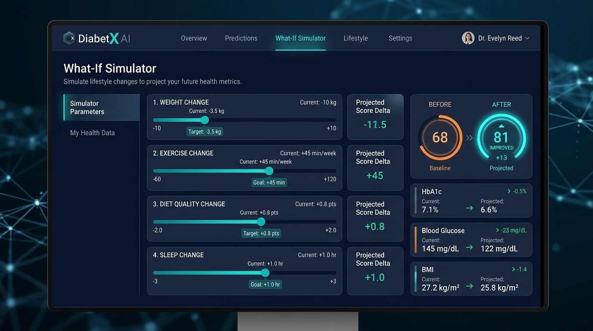
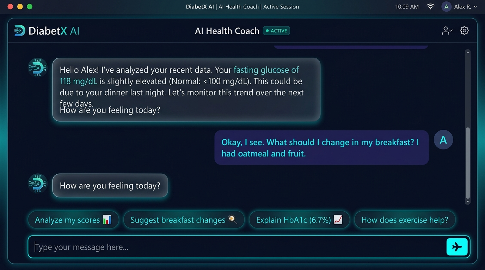
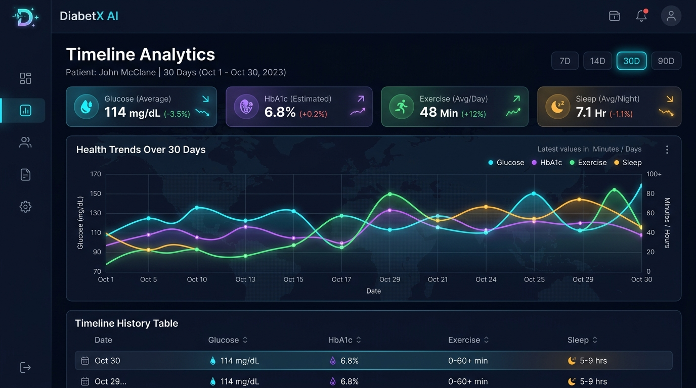

<p align="center">
  
</p>

<h1 align="center">🧬 DiabetX AI — Cyber-Physiological Digital Twin</h1>

<p align="center">
  <strong>An AI-powered digital twin for Type-2 Diabetes and Pre-Diabetes self-management</strong>
</p>

<p align="center">
  <a href="https://diabetx.vercel.app"></a>
  <a href="https://github.com/Rahim36712/diabetx"></a>
</p>

---

## 🌍 The Problem

**463 million** adults worldwide live with diabetes (IDF Diabetes Atlas, 2023), with Type-2 Diabetes accounting for ~90% of all cases. Most patients struggle with:

- **Fragmented tracking** — glucose logs, weight, sleep, and exercise are scattered across different apps and paper notes.
- **No predictive insight** — patients can't see how changing one habit (e.g., +30 min walking) would impact their metabolic health *before* committing to it.
- **Generic advice** — most health apps give cookie-cutter tips instead of personalized, data-grounded guidance.

### Who Is This For?

DiabetX AI is built for **individuals with Type-2 Diabetes or Pre-Diabetes** who want to:
- Visualize their health as a single, intuitive 0–100 score.
- Explore "What-If" lifestyle scenarios using a deterministic digital twin simulation.
- Receive personalized AI coaching grounded in *their own logged data*, not generic articles.

---

## 🚀 Live Deployed URL

### 👉 [https://diabetx.vercel.app](https://diabetx.vercel.app)

Open the link above in any browser — no login, no signup, fully functional.

---

## ✨ Features

| Feature | Description |
|---------|-------------|
| **🧬 Digital Twin Score Engine** | A deterministic, transparent scoring system that computes a 0–100 composite health index from your metabolic markers, activity levels, and nutrition quality. No black-box AI — every score is reproducible and explainable. |
| **🫀 Interactive 3D Human Model** | A real-time Three.js-rendered glowing cyber-silhouette that responds to your health score — the wireframe color and pulse intensity shift from red (poor) through amber to cyan (excellent). |
| **📊 Timeline Analytics** | Multi-metric historical trend charts tracking fasting glucose, HbA1c, exercise, sleep, and diet quality over selectable 7/14/30/90-day windows with Recharts interactive tooltips. |
| **🔮 What-If Simulator** | Adjust weight, exercise, diet quality, and sleep with interactive sliders. See projected score deltas and estimated biomarker changes *instantly* — deterministic formulas, no network round-trip. |
| **🤖 Gemini AI Health Coach** | A conversational AI assistant powered by Google Gemini API that receives your *actual logged biometrics and simulation data* as context, providing personalized, number-grounded health guidance. |
| **📝 Daily Entry Logging** | Log weight (kg), HbA1c (%), fasting glucose (mg/dL), sleep (hours), exercise (min/week), and diet quality (1–5) with persistent localStorage. |
| **📋 Entry History** | Searchable and deletable history table of all logged entries. |
| **🔒 100% Client-Side Privacy** | All health data stays in your browser's localStorage — nothing is sent to any server. The only network call is the AI Coach chat, which sends a temporary context snapshot to Google's API. |
| **📱 Responsive Design** | Fully responsive layout with desktop sidebar navigation and mobile bottom navigation bar. |

---

## 🤖 AI Feature — Gemini Health Coach

### What It Does

The AI Health Coach is a conversational assistant that **grounds every response in your actual logged biometrics**. When you ask "How am I doing?", it doesn't give generic diabetes advice — it says "Your fasting glucose of 118 mg/dL is above the healthy range (<100), weighing down your Metabolic score of 76."

When you're running a **What-If Simulation**, the AI also sees your simulated scenario and projected scores, enabling it to comment on hypothetical changes: "With your +60 min/week exercise shift, your projected composite score improves from 78 to 86."

### System Prompt

The AI operates under a carefully designed system prompt:

```
You are the DiabetX Coach, an educational assistant inside a diabetes
self-management app. You are talking to someone who is logging their own
weight, HbA1c, fasting glucose, sleep, exercise, and diet quality, and
exploring interactive What-If digital twin simulations.

Rules you must follow:
1. You are NOT a doctor. Never diagnose, never say "you have" a condition,
   and never recommend specific medication changes or dosages.
2. Every claim you make about the user's health MUST reference at least one
   specific number from the DATA block below (e.g. "your fasting glucose of
   118 mg/dL is..."). Do not give generic advice that ignores their numbers.
3. If WHAT-IF SIMULATION MODE is active, explicitly address their simulated
   scenario adjustments and projected score impact.
4. If a score or metric is missing from the data, say so instead of guessing.
5. Keep answers short: 3-5 sentences, plain language, no medical jargon
   without a one-line explanation.
6. End with one concrete, low-risk next step — never a drug, supplement,
   or diagnostic claim.
7. If the user's question is about a medical emergency, tell them to seek
   in-person or emergency medical care immediately.
```

### Context Grounding Engine

Each AI request includes a dynamically constructed `DATA` block containing:
- All current biometric values (weight, HbA1c, glucose, sleep, exercise, diet)
- Computed Digital Twin scores (composite, metabolic, activity, nutrition)
- Active What-If simulation deltas and projected scores (when simulator is active)

### Model Fallback Chain

The app uses a **cascading model fallback** for maximum free-tier reliability:

| Priority | Model | Free Tier Limit |
|----------|-------|-----------------|
| 1st | `gemini-3.1-flash-lite` | 500 req/day, 15 req/min |
| 2nd | `gemini-2.5-flash-lite` | 20 req/day, 10 req/min |
| 3rd | `gemini-2.5-flash` | 20 req/day, 5 req/min |
| 4th | `gemini-1.5-flash` | Fallback |

---

## 🛠️ Tech Stack & Tools

| Category | Technology |
|----------|-----------|
| **Framework** | [Next.js 16](https://nextjs.org/) (App Router, Turbopack) |
| **Language** | [TypeScript](https://www.typescriptlang.org/) 5.6 |
| **UI Library** | [React 19](https://react.dev/) |
| **Styling** | [Tailwind CSS 3.4](https://tailwindcss.com/) + Custom Glassmorphism Design System |
| **3D Rendering** | [Three.js](https://threejs.org/) (WebGL human silhouette with GLSL shaders) |
| **Charts** | [Recharts 2.15](https://recharts.org/) |
| **AI Model** | [Google Gemini API](https://ai.google.dev/) (gemini-3.1-flash-lite) |
| **Deployment** | [Vercel](https://vercel.com/) |
| **UI Design** | [Google Stitch MCP](https://stitch.withgoogle.com/) (design token generation) |
| **Data Storage** | Browser localStorage (zero server-side data) |
| **Font** | [Space Grotesk](https://fonts.google.com/specimen/Space+Grotesk) (headings) + [Inter](https://fonts.google.com/specimen/Inter) (body) |
| **Icons** | [Material Symbols](https://fonts.google.com/icons) (Filled variant) |

---

## 📸 Screenshots

### Dashboard — Digital Twin Score & 3D Model

> The main dashboard displays your composite 0–100 Digital Twin Score in an animated ring gauge, sub-score breakdown cards (Metabolic, Activity, Nutrition), and a real-time 3D glowing human silhouette rendered with Three.js.

### What-If Simulator

> Interactive sliders let you simulate hypothetical lifestyle changes (weight, exercise, diet, sleep) and instantly see projected score deltas and estimated biomarker shifts — all computed deterministically without any AI call.

### AI Health Coach

> The Gemini-powered AI Health Coach receives your actual logged biometrics and active simulation data as context, delivering personalized, number-grounded health guidance with quick-prompt suggestions.

### Timeline Analytics

> Multi-metric historical trend charts tracking glucose, HbA1c, exercise, sleep, and diet quality over selectable time windows with interactive tooltips and color-coded trend lines.

---

## 🏗️ Project Structure

```
diabetx/
├── app/
│   ├── api/coach/route.ts       # Gemini AI Coach API endpoint
│   ├── globals.css               # Global styles & design tokens
│   ├── layout.tsx                # Root layout (nav bars, shader bg)
│   └── page.tsx                  # Main page with tab routing
├── components/
│   ├── views/
│   │   ├── DashboardView.tsx     # Dashboard tab content
│   │   ├── DigitalTwinView.tsx   # 3D Digital Twin tab
│   │   ├── TimelineView.tsx      # Timeline analytics tab
│   │   ├── SimulatorView.tsx     # What-If simulator tab
│   │   └── AiCoachView.tsx       # AI Coach chat tab
│   ├── AiCoach.tsx               # AI chat component
│   ├── EntryForm.tsx             # Daily health entry form
│   ├── EntryHistory.tsx          # Entry history table
│   ├── ScoreCards.tsx            # Sub-score metric cards
│   ├── ScoreRing.tsx             # Animated score gauge ring
│   ├── ShaderBackground.tsx      # WebGL GLSL shader background
│   ├── SimulationPanel.tsx       # What-If slider controls
│   ├── ThreeDigitalTwinCanvas.tsx # Three.js 3D human model
│   ├── TimelineChart.tsx         # Recharts trend charts
│   ├── SideNavBar.tsx            # Desktop sidebar navigation
│   ├── TopNavBar.tsx             # Mobile top header
│   └── BottomNavBar.tsx          # Mobile bottom navigation
├── context/
│   └── NavContext.tsx            # Global navigation state
├── lib/
│   ├── twin.ts                   # Digital Twin scoring engine
│   ├── storage.ts                # localStorage persistence
│   └── types.ts                  # TypeScript type definitions
├── .env.example                  # Environment variable template
├── package.json
├── tailwind.config.ts
└── tsconfig.json
```

---

## 🚀 How to Run Locally

### Prerequisites

- **Node.js** 18+ (recommended: 20+)
- **npm** 9+
- A free **Google Gemini API key** from [Google AI Studio](https://aistudio.google.com/app/apikey)

### Installation

```bash
# 1. Clone the repository
git clone https://github.com/Rahim36712/diabetx.git
cd diabetx

# 2. Install dependencies
npm install

# 3. Set up environment variables
cp .env.example .env.local
```

Edit `.env.local` and add your Gemini API key:

```env
GEMINI_API_KEY=your_gemini_api_key_here
```

> 💡 Get a **free** API key at [aistudio.google.com/app/apikey](https://aistudio.google.com/app/apikey) — no credit card required.

```bash
# 4. Start the development server
npm run dev
```

Open [http://localhost:3000](http://localhost:3000) in your browser.

### Production Build

```bash
npm run build
npm start
```

---

## 🧮 Scoring Algorithm

The Digital Twin Score is **fully deterministic** — no AI model is involved in score computation. This ensures scores are reproducible, transparent, and explainable.

| Sub-Score | Formula | Weight |
|-----------|---------|--------|
| **Metabolic** | Average of HbA1c penalty `(100 − (HbA1c − 5.0) × 25)` and Glucose penalty `(100 − (glucose − 90) × 0.8)` | 45% |
| **Activity** | Average of Exercise fill `(exercise / 150 × 100)` and Sleep proximity `(100 − |sleep − 8| × 20)` | 30% |
| **Nutrition** | Diet quality normalized `(diet / 5 × 100)` | 25% |
| **Composite** | `Metabolic × 0.45 + Activity × 0.30 + Nutrition × 0.25` | — |

All values are clamped to 0–100. Reference ranges are anchored to ADA HbA1c guidelines and WHO exercise recommendations.

---

## 📄 License

This project was built as an individual coursework submission. All code is original.

---

<p align="center">
  Built with ❤️ using Next.js, Three.js, and Google Gemini AI
</p>
