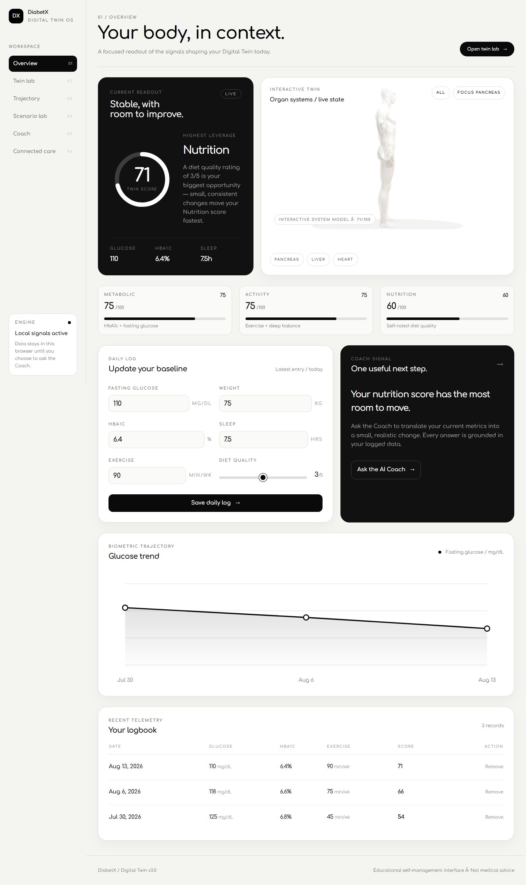
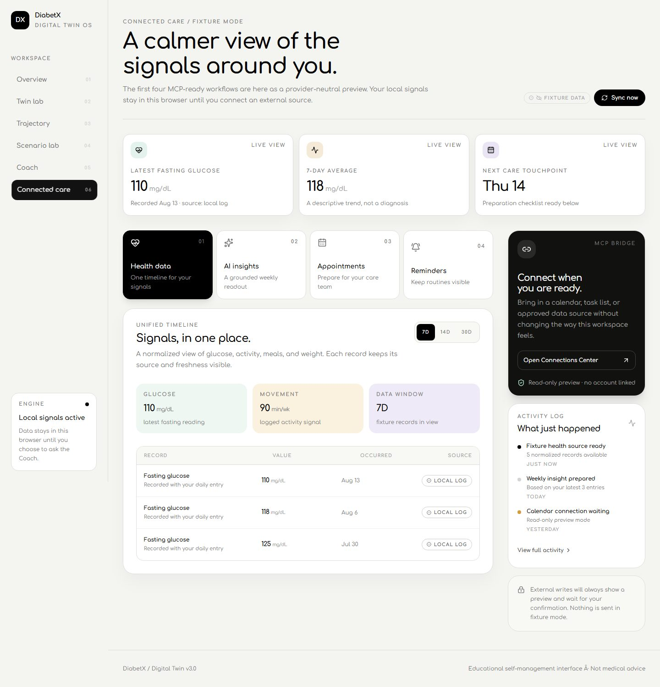
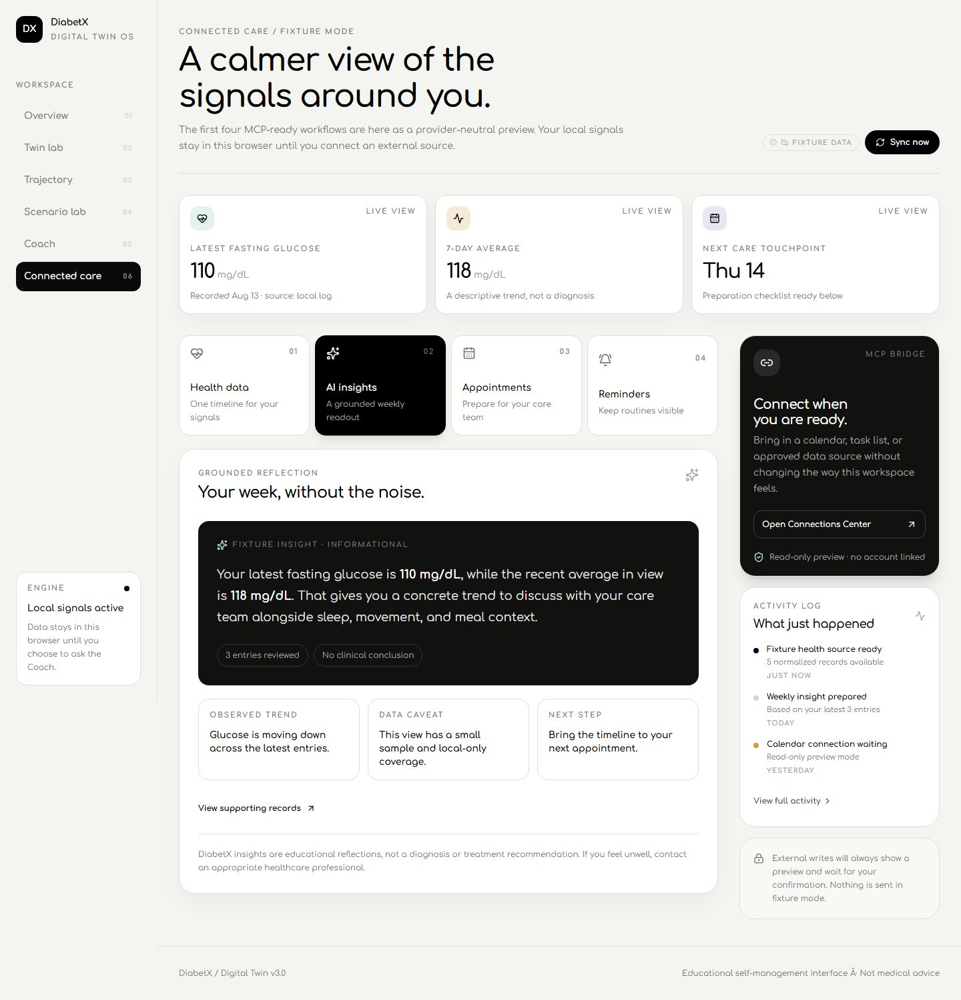
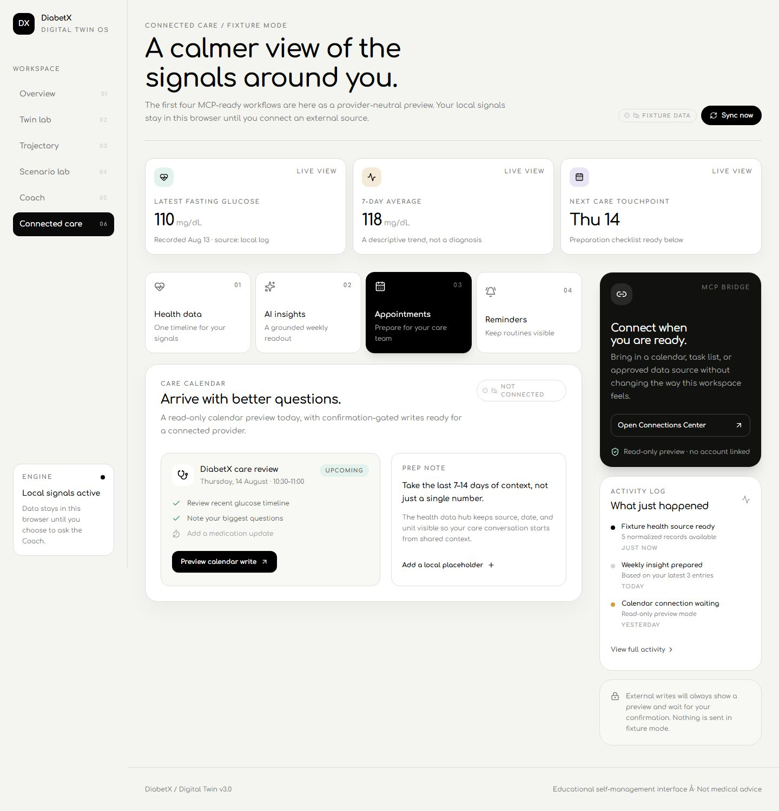
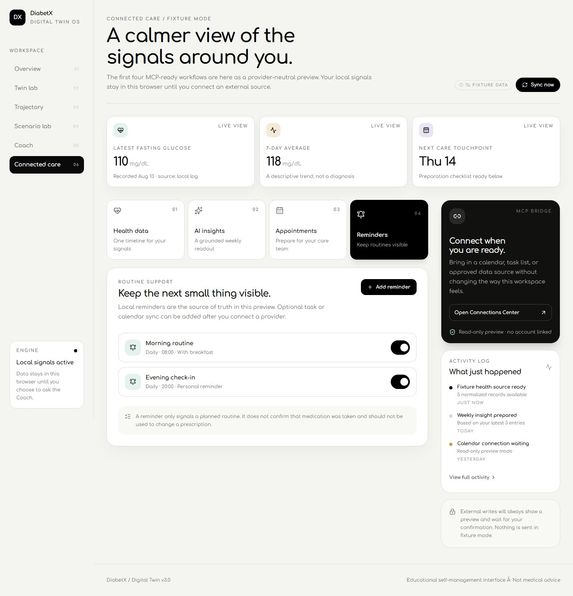
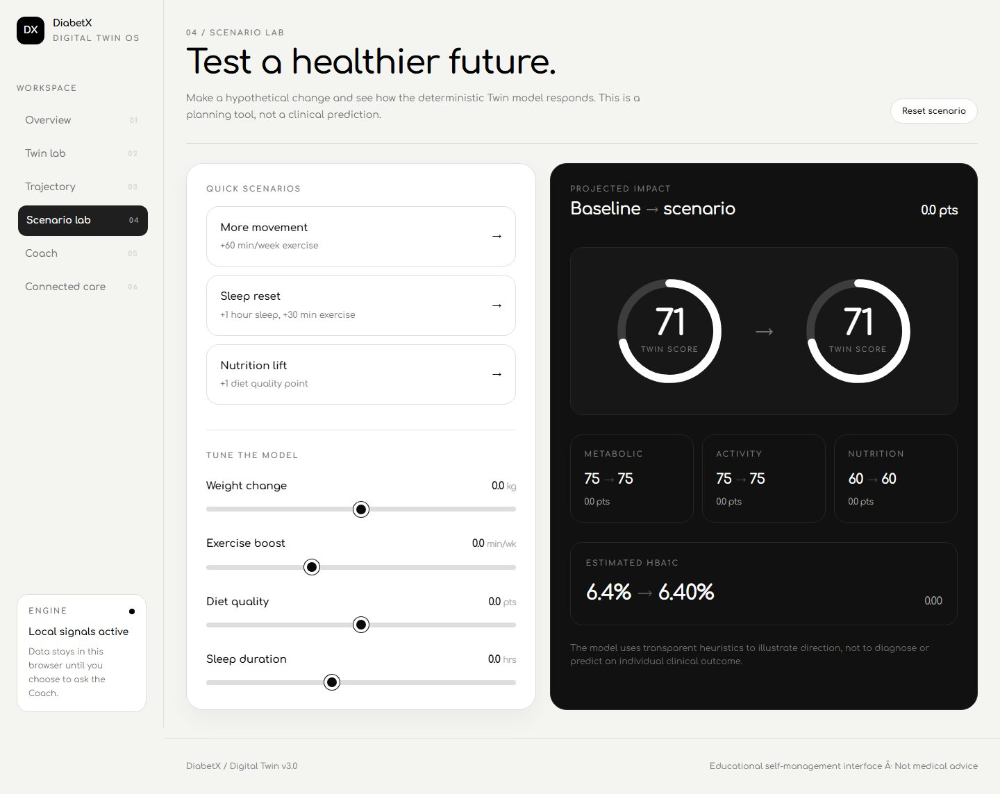
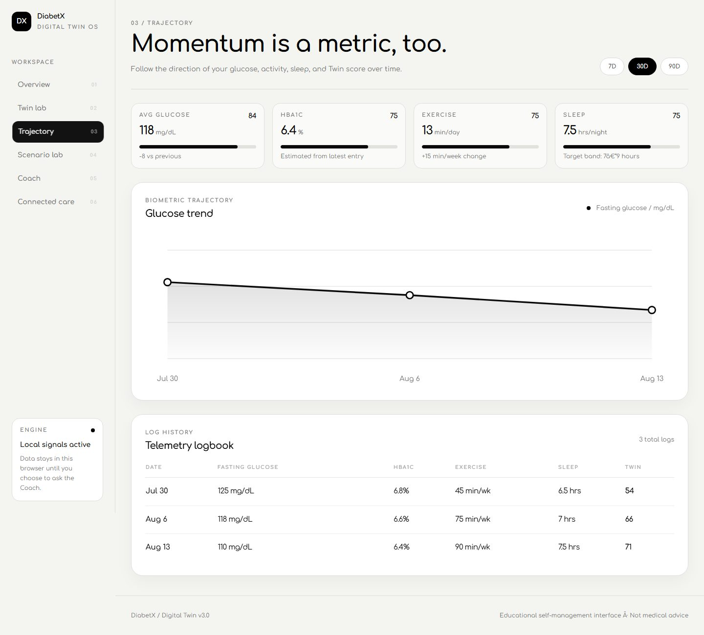

# DiabetX

> **A browser-first digital twin for metabolic self-reflection.** DiabetX turns personal health entries into a transparent score, an interactive body model, scenario simulations, grounded coaching, and a new Connected Care workspace.

<p align="center">
  
</p>

<p align="center">
  <strong>Log signals. Explore scenarios. Prepare better care conversations.</strong>
</p>

<p align="center">
  <a href="#quickstart">Quickstart</a> ·
  <a href="#product-surface">Product surface</a> ·
  <a href="#connected-care-workspace">Connected Care</a> ·
  <a href="#architecture">Architecture</a>
</p>

## Why DiabetX

DiabetX is designed as an **educational reflection layer**, not a diagnostic system. It keeps the score engine deterministic and explainable, gives users a visual model of the signals they log, and makes it easier to see patterns before a conversation with a qualified care professional.

The core experience is intentionally browser-first. Daily entries persist locally in the browser, while the optional AI Coach receives a temporary context snapshot only when the user chooses to ask a question. The Connected Care workspace is provider-neutral and begins in clearly labeled fixture mode until a calendar, task, or approved health-data source is connected.

## Product surface

| Area | What it does |
|---|---|
| **Digital Twin score** | Computes a reproducible 0–100 composite score from metabolic, activity, and nutrition signals. |
| **Interactive body model** | Visualizes the score through a glowing Three.js human silhouette and organ-focused context. |
| **Trajectory analytics** | Tracks logged glucose, HbA1c, weight, sleep, exercise, and diet quality over time. |
| **Scenario lab** | Tests hypothetical changes to weight, movement, nutrition, and sleep without a network round-trip. |
| **AI Health Coach** | Provides short, number-grounded educational reflections using the user’s current context. |
| **Connected Care workspace** | Brings health data, informational insights, appointments, and reminders into one MCP-ready UI. |

## Connected Care workspace

The newest DiabetX surface is a **provider-neutral integration layer** designed to become the UI boundary for MCP-backed workflows. It keeps the interface useful before a provider is authorized and makes the transition to live integrations explicit.

### Connected health data hub

The health data hub presents a unified timeline with glucose metrics, date-range filters, source badges, freshness language, and a simulated synchronization event. Records are framed as local log or fixture data until an external source is genuinely connected.

<p align="center">
  
</p>

### Grounded AI insights

The insights view turns the latest logged values into a compact, traceable reflection. It shows the observed trend, data caveats, supporting-record context, and an explicit informational disclaimer rather than presenting a diagnosis or treatment recommendation.

<p align="center">
  
</p>

### Appointment assistant

The appointment view includes an upcoming care-review card, a preparation checklist, source status, and a confirmation-gated preview for future calendar writes. Fixture mode never sends an external write.

<p align="center">
  
</p>

### Medication reminders

The reminders view is local-first. Users can add a reminder, pause or resume it, and see clear language that a reminder represents a planned routine rather than confirmation that medication was taken.

<p align="center">
  
</p>

## Digital Twin experience

### What-If Simulator

The Scenario Lab uses deterministic formulas to show how hypothetical lifestyle changes affect projected scores and biomarker context. It is intentionally separate from AI generation, so the calculation remains reproducible.



### Timeline Analytics

Historical entries can be inspected through a selectable time window with interactive charts and supporting metrics. The timeline is intended to help users discuss patterns rather than interpret a single reading in isolation.



## Privacy and safety

DiabetX is built around **explicit user choice and transparent provenance**:

- Health entries remain in browser storage by default.
- External connections should be read-only until the user grants write permission.
- External writes must show a preview and require confirmation.
- Fixture data is labeled and is never presented as a live provider connection.
- AI reflections are educational and should not be used to diagnose conditions or change medication.
- Urgent or concerning symptoms require appropriate in-person or emergency medical care.

## Architecture

```text
diabetx/
├── app/
│   ├── api/coach/route.ts       # AI Coach API boundary
│   ├── globals.css              # Global styles and design tokens
│   ├── layout.tsx               # Root layout and providers
│   └── page.tsx                 # Main tabbed application shell
├── components/
│   ├── McpWorkspaceView.tsx     # Connected Care fixture/MCP-ready workspace
│   ├── views/                   # Dashboard, twin, timeline, simulator, coach
│   ├── ThreeDigitalTwinCanvas.tsx
│   ├── OrganTwinLab.tsx
│   └── ...
├── context/
│   └── NavContext.tsx           # Global navigation state
├── lib/
│   ├── twin.ts                  # Deterministic score engine
│   ├── storage.ts               # Local browser persistence
│   ├── organMetrics.ts          # Organ context metrics
│   └── types.ts                 # Shared TypeScript types
├── docs/screenshots/             # README product screenshots
├── public/models/                # 3D model assets
├── package.json
└── tsconfig.json
```

## Quickstart

### Prerequisites

- Node.js 18 or newer; Node.js 20 or newer is recommended.
- npm 9 or newer.
- A Google Gemini API key if you want to use the optional AI Coach.

### Installation

```bash
git clone https://github.com/Rahim36712/diabetx.git
cd diabetx
npm install
copy .env.example .env.local
```

Add the Gemini key to `.env.local` when using the AI Coach:

```env
GEMINI_API_KEY=your_gemini_api_key_here
```

Start the development server:

```bash
npm run dev
```

Then open [http://localhost:3000](http://localhost:3000).

### Production build

```bash
npm run build
npm start
```

## Deterministic scoring model

The Digital Twin score is computed without an AI model. The score combines three explainable sub-scores:

| Sub-score | Inputs | Composite weight |
|---|---|---:|
| **Metabolic** | HbA1c and fasting glucose | 45% |
| **Activity** | Exercise minutes and sleep proximity | 30% |
| **Nutrition** | Self-rated diet quality | 25% |

All sub-scores are clamped to a 0–100 range. The score is a reflection aid, not a clinical measurement.

## Development checks

The project currently uses the following checks:

```bash
npm run build
npm run lint
```

## License

This project was built as an individual coursework submission. All code is original to the project unless otherwise noted in the dependency licenses.

<p align="center">
  Built with Next.js, React, TypeScript, Three.js, Recharts, Tailwind CSS, and Google Gemini AI.
</p>
